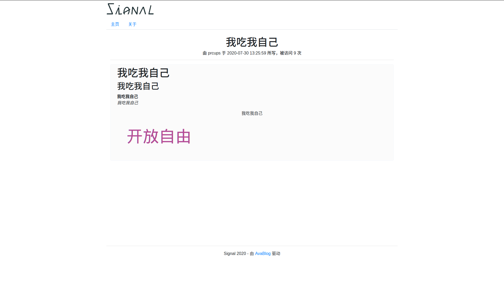
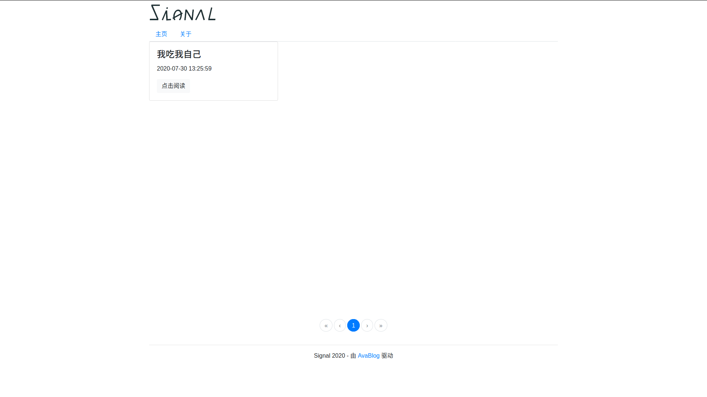
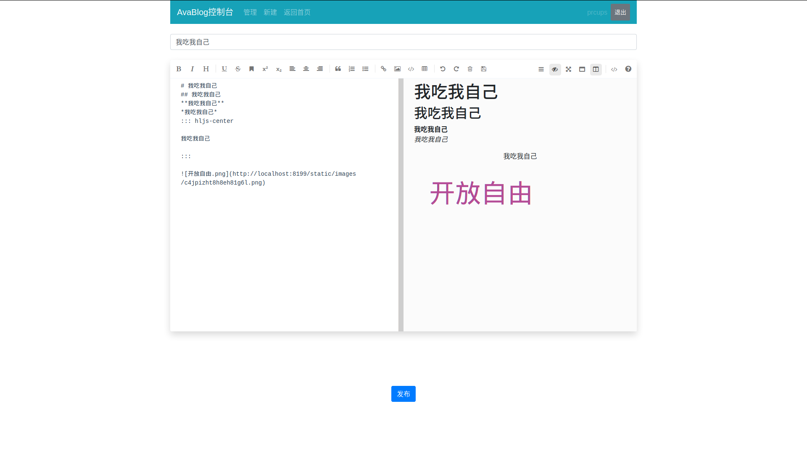
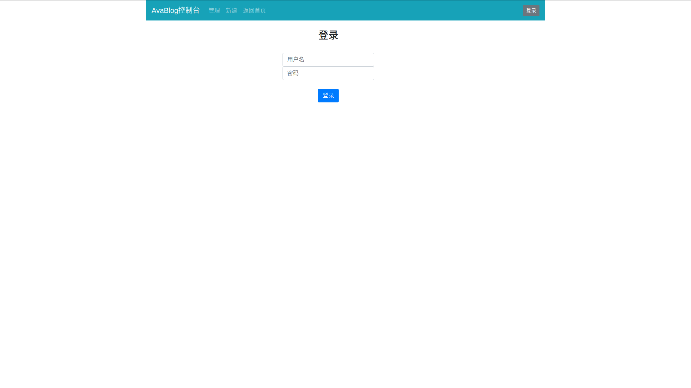
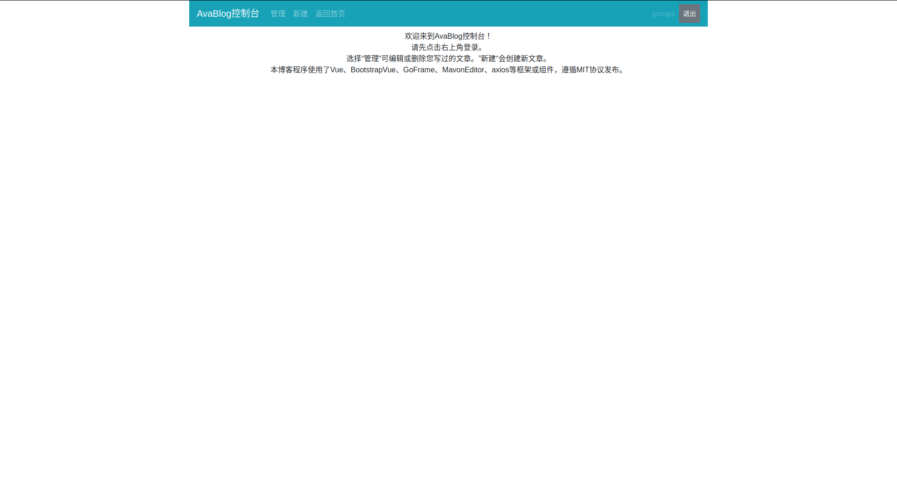

# natsunaBlog 0.2.0

## 一个简单的个人博客程序

## 介绍

技术栈：Vue + GoFrame

使用插件：主要是MavonEditor

## 开发计划

- 提供部署与设置中心

## 更新日志
natsunaBlog 0.2.0

- 优化自适应设置
- 优化打开速度
- 使用新的独立页面逻辑
- 大小标签管理
- 站内搜索

natsunaBlog 0.1.2 (AvaBlog)

- Markdown格式文章的查看、解析、修改、删除
- 访问次数统计

## 部署方法

1. 安装npm、go。
2. 安装node依赖：vue/cli

## 截图

